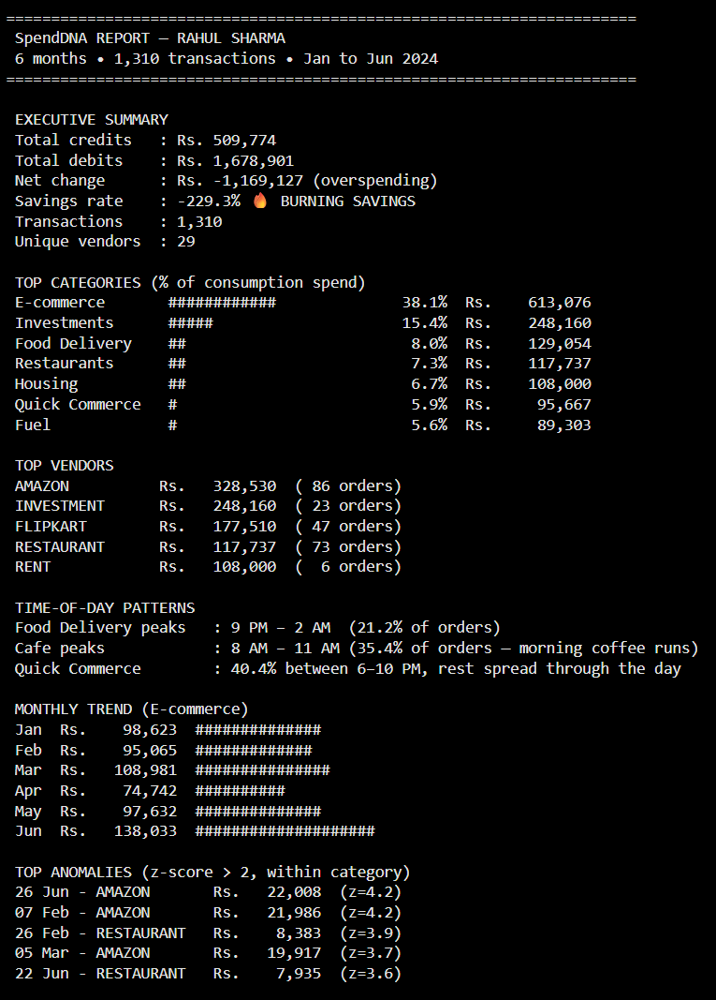
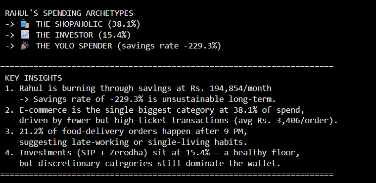

# 💰 SpendDNA — Your Wallet's Year-End Story

> Spotify Wrapped, but for your money. A from-scratch Python transaction-analytics
> engine that cleans messy UPI/bank export data, extracts vendors from noisy
> descriptions, categorises spend, flags anomalies, and detects a "spending
> personality" archetype — built with only NumPy + Pandas, no ML, no
> pandas-profiling, no regex.

**Author:** Shoyal Haldar
**Project:** Week 2 Minor Project, The Unlox Academy (SpendDNA)

🔗 **Colab Notebook:** [Open in Colab](https://colab.research.google.com/drive/10WacLH64mHHIqPCWXBotvMeCAU6iyHjk?usp=sharing)

---

## 📸 Output Preview

**Final Report —**




---

## 🧠 What This Project Does

Given 6 months (Jan–Jun 2024) of a fictional Bengaluru software engineer's
raw UPI/bank transaction export — a genuinely messy CSV with 4 mixed date
formats, 3 amount notations, and dozens of inconsistent vendor description
formats — this notebook:

1. **Parses** the raw CSV (4 date formats, 3 amount formats, DR/CR variants, duplicates)
2. **Extracts canonical vendors** from noisy descriptions (e.g. `BUNDL Tech P L` → Swiggy,
   `AMZN-INTPYMT` → Amazon) using a hand-built keyword dictionary — no regex
3. **Categorises** every transaction into 12+ spending categories
4. **Computes** an executive spending overview (credits, debits, savings rate)
5. **Builds** a monthly spending trend matrix per category
6. **Analyses** time-of-day spending patterns (e.g. late-night food orders)
7. **Flags anomalies** using a per-category z-score (transactions 2+ std-dev
   above the category mean)
8. **Detects spending archetypes** (Foodie, Shopaholic, Investor, YOLO Spender, etc.)
   using quantitative, function-based rules
9. **Prints a final formatted report** — the "screenshot-worthy" summary

## 📊 Key Findings (on the provided dataset)

- **1,310** clean transactions after removing 18 duplicates
- **35** canonical vendors extracted from **283** raw description variants
- **27** anomalous transactions flagged via z-score
- Archetypes detected: **The Shopaholic**, **The Investor**, **The YOLO Spender**
- E-commerce (Amazon/Flipkart/Myntra) dominates total spend — not Food Delivery —
  because individual e-commerce transactions run far higher in ticket size
  even though food-delivery orders are more frequent

## 🛠️ Tech Stack

**Used:** Python fundamentals, NumPy, Pandas (`groupby`, `pivot_table`, `transform`,
`.dt`, `.str`), datetime, f-strings

**Deliberately avoided** (constraint discipline is the point of the project):
regex, `collections.Counter`, matplotlib/seaborn/plotly, scikit-learn/scipy.stats,
pandas-profiling/sweetviz, any ML/GenAI library, any external transaction dataset

## 📂 Repo Structure

```
SpendDNA-UPI-Transaction-Analyzer/
├── SPENDDNA_SHOYAL_HALDAR.ipynb     # main notebook
├── rahul_transactions.csv           # synthetic dataset
├── assets/
│   ├── output_1.png                 # final report screenshot (part 1)
│   └── output_2.png                 # final report screenshot (part 2)
└── README.md
```

## ▶️ How to Run

1. Open the notebook in [Google Colab](https://colab.research.google.com/drive/10WacLH64mHHIqPCWXBotvMeCAU6iyHjk?usp=sharing)
   (or clone this repo and open locally in Jupyter)
2. Upload `rahul_transactions.csv` to the same session/folder
3. Run all cells top to bottom — no external API keys or credentials needed
4. Final formatted report prints in the last cell

## 🤖 AI-Assistance Disclosure

Some cells used AI assistance for debugging logic and understanding approach
(marked inline with `# AI-assisted:` comments), per the project's honesty policy.
Vendor-mapping decisions, category logic, and final insights are based on
direct inspection of this specific dataset.

## 📄 License

Educational project — synthetic data only, no real financial information.